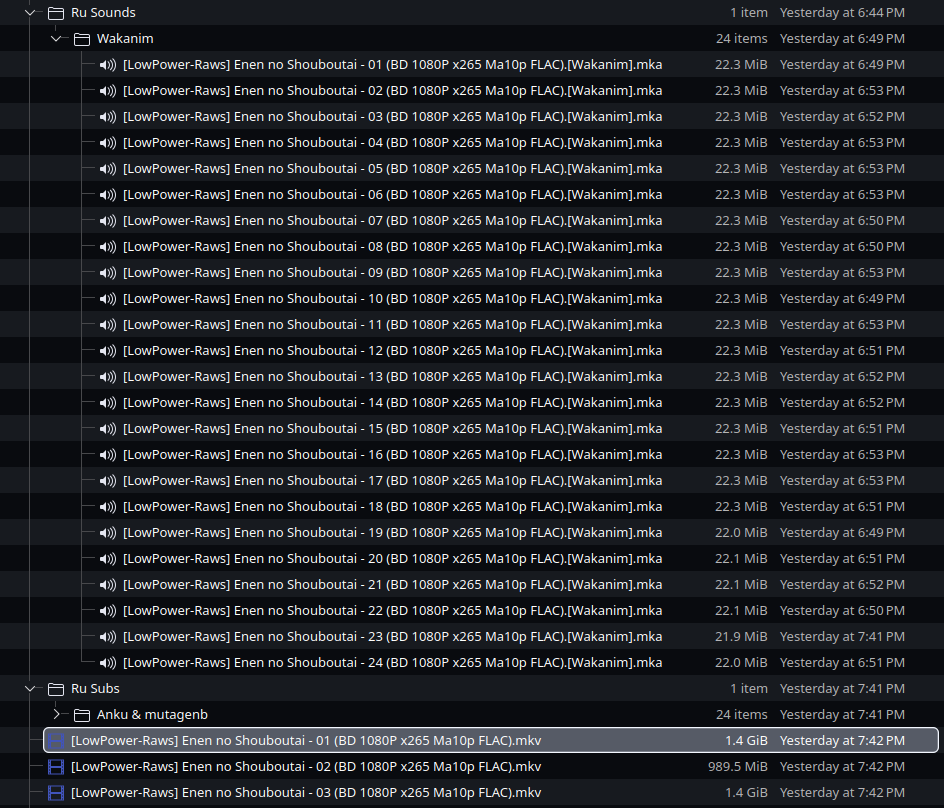

# Mpv-Script

Add audio and subtitles from subfolders to a video in mpv.

## How to install

Paste `audio-subtitles.lua` into the `scripts` folder in your mpv configuration directory.

## Default configuration directories

**Linux**
```
~/.config/mpv/
```

**Windows**
```
%APPDATA%\mpv\
```

**macOS**
```
~/Library/Application Support/mpv/
```

## How it works

Before

After

